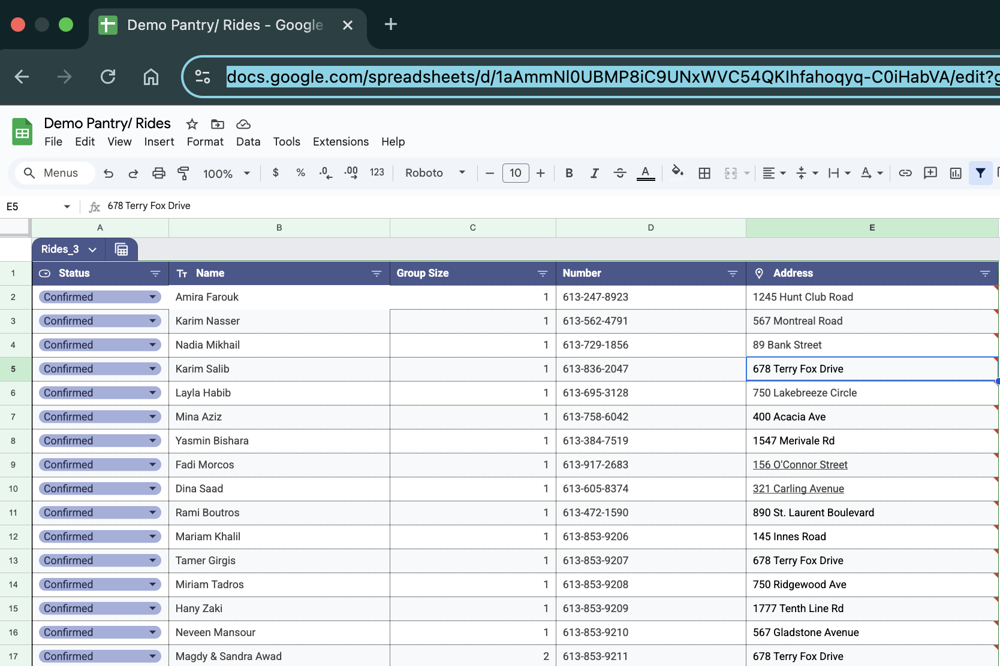
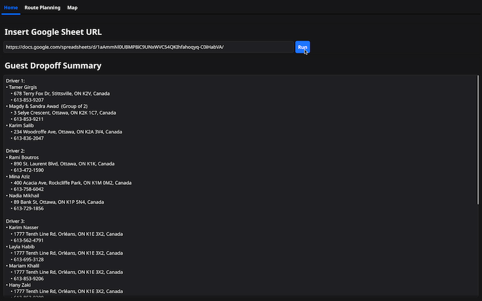
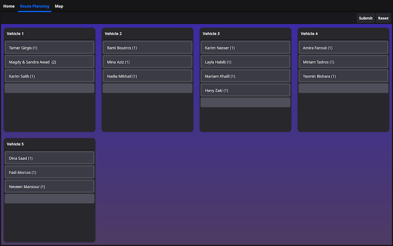
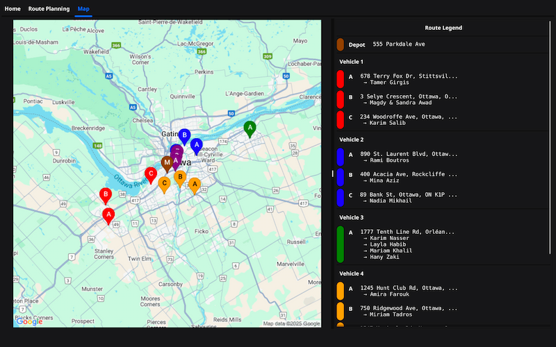

# Outreach Routing Planner


A Go desktop application that optimizes transportation routes for community service operations through intelligent algorithms and intuitive visual management. This application serves to aid the transportation coordination for Anba Abraam Service, automating complex route planning that previously required hours of manual coordination.

Anba Abraam Service is a community outreach organization that provides essential services to families and individuals in need throughout the Ottawa area. The service operates two primary programs: weekly dinner events where guests are transported from the St Mary & St Mark Church to their homes, and grocery delivery services that distribute food packages directly to families' residences. With dozens of guests spread across the city and limited volunteer drivers, efficient route planning is needed to ensuring timely service delivery while minimizing travel time. 


### Core Technologies
- **Language**: Go 1.24+
- **GUI Framework**: Fyne v2.6 for cross-platform native desktop development
- **External APIs**: Google Maps (geocoding), OSRM (routing), Google Sheets (database)

### Algorithm Implementation
- **Clarke-Wright Savings Algorithm**: Distance-based optimization for dinner events
- **K-means++ Clustering**: Geographic distribution optimization for grocery delivery routes


### Key Engineering Features
- **Custom Drag-and-Drop System**: Visual feedback with collision detection and capacity validation
- **State Management**: Full undo/redo capability with snapshot-based preservation
- **Robust API Integration**: Error handling and retry logic for external services


## Project Structure

```
/cmd/                   → Application entry point
/internal/
  ├── app/             → Core domain logic (VRP algorithms, route management)
  ├── ui/              → Fyne GUI components (primary adapters)
  ├── database/        → Google Sheets integration (secondary adapter)
  ├── geoapi/          → External API clients (secondary adapters)
  ├── converter/       → Data transformation layer
  ├── coordinates/     → Geographic utilities
  └── config/          → Configuration management
```

## Key Features

### Intelligent Routing
- Dual algorithm strategy that automatically selects optimal approach based on event type
- Address validation with Ottawa-specific geocoding
- Pre-computed distance matrices using real road network data


### Interactive Interface
- Multi-tab workflow: Home → Route Planning → Map Visualization
- Drag-and-drop guest assignment between vehicles with visual feedback
- Real-time map visualization with Google Maps integration
- State management with reset/submit capabilities

### Data Integration
- Direct Google Sheets import with structured data validation
- Automatic address geocoding and coordinate conversion

## Input Data Format

### Required Headers
```
Status | Name | Group Size | Number | Address
```

### Address Guidelines
- All addresses must be valid Ottawa, ON locations
- Please keep addresses !
- Example: `96 George Street`
- Avoid extra notes in address field

### Status Values
- `Confirmed`: Requires transportation
- `Grocery Only`: Grocery delivery only
- `Pending`: Awaiting confirmation
- `NO`: Not requiring service







